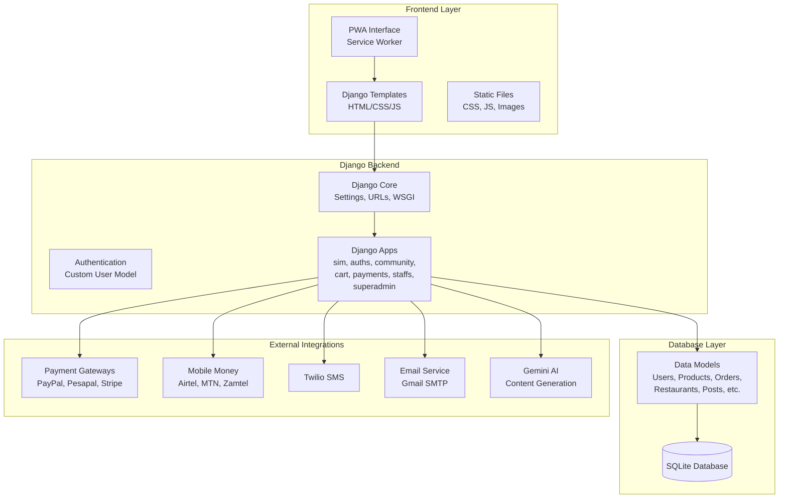
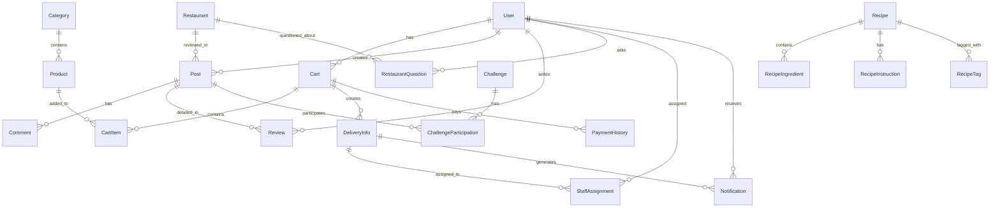

# EatNearby Project Structure and System Architecture

## Overview

EatNearby is a comprehensive Django-based food delivery and community platform built as a Progressive Web App (PWA). The system enables customers to order food from nearby restaurants, participate in community features, and provides administrative tools for restaurant management and delivery coordination.

## High-Level Architecture



## Project Directory Structure

```
eatnearby/
├── manage.py                          # Django management script
├── core/                              # Project configuration
│   ├── __init__.py
│   ├── settings.py                    # Main settings (DEBUG=True, PWA config)
│   ├── urls.py                        # Root URL configuration
│   └── wsgi.py                        # WSGI application
├── auths/                             # Authentication and products
│   ├── models.py                      # User, Category, Product models
│   ├── views/                         # Authentication views
│   └── templates/                     # Login/signup templates
├── sim/                               # Main frontend app
│   ├── models.py                      # Empty (views handle display)
│   ├── views.py                       # Home, menu, contact views
│   ├── templates/                     # Base templates, home, menu
│   └── static/                        # Images, CSS, JS
├── community/                         # Community features
│   ├── models.py                      # Restaurant, Post, Review, Recipe models
│   ├── views/                         # Community views (posts, challenges)
│   └── templates/                     # Community templates
├── cart/                              # Shopping cart
│   ├── models.py                      # Cart, CartItem models
│   └── views.py                       # Cart management
├── payments/                          # Payment and delivery
│   ├── models.py                      # DeliveryInfo, PaymentHistory
│   └── views.py                       # Payment processing
├── staffs/                            # Staff management
│   ├── models.py                      # Staff assignments, notifications
│   └── views.py                       # Staff dashboard
├── superadmin/                        # Administrative panel
│   ├── models.py                      # Empty (logic in views)
│   ├── *_views.py                     # Admin views for all modules
│   └── templates/                     # Admin templates
├── static/                            # Global static files
│   ├── js/service-worker.js           # PWA service worker
│   └── manifest.json                  # PWA manifest
├── staticfiles/                       # Collected static files
├── media/                             # User uploaded files
├── templates/                         # Global templates
├── requirements.txt                   # Python dependencies
├── db.sqlite3                         # SQLite database
└── debug.log                          # Application logs
```

## Django Apps Breakdown

### 1. auths (Authentication & Products)
**Purpose**: User management and product catalog
**Key Models**:
- `User`: Custom user model with types (admin/customer/staff)
- `Category`: Product categories
- `Product`: Abstract base for food items
- `FastFood`, `Food`, `Drink`: Concrete product types

### 2. sim (Main Frontend)
**Purpose**: Public-facing website and PWA interface
**Features**:
- Home page with restaurant listings
- Menu display
- Contact/About pages
- PWA capabilities (offline support, installable)

### 3. community (Social Features)
**Purpose**: Restaurant reviews, recipes, challenges, Q&A
**Key Models**:
- `Restaurant`: Restaurant profiles
- `Post`: Community posts with types (story/tip/question/review)
- `Review`: Detailed restaurant reviews with ratings
- `Challenge`: Community challenges
- `Recipe`: User-submitted recipes
- `RestaurantQuestion/Answer`: Q&A with restaurants

### 4. cart (Shopping Cart)
**Purpose**: Order management
**Key Models**:
- `Cart`: User shopping carts
- `CartItem`: Individual cart items

### 5. payments (Payment & Delivery)
**Purpose**: Order fulfillment and payment processing
**Key Models**:
- `DeliveryInfo`: Delivery details and tracking
- `PaymentHistory`: Payment records
**Integrations**: PayPal, Pesapal, Stripe, Mobile Money (Airtel/MTN/Zamtel)

### 6. staffs (Staff Management)
**Purpose**: Delivery staff coordination
**Key Models**:
- `StaffServiceArea`: Staff coverage areas
- `StaffAssignment`: Delivery assignments
- `Notification`: Staff notifications

### 7. superadmin (Administrative Panel)
**Purpose**: Comprehensive admin interface
**Features**: Management views for all system components

## Database Schema Overview



## External Integrations

### Payment Systems
- **PayPal**: International payments
- **Pesapal**: Local payment gateway
- **Stripe**: Credit card processing
- **Mobile Money**: Airtel, MTN, Zamtel integration

### Communication
- **Twilio**: SMS notifications for deliveries
- **Email**: Gmail SMTP for user communications

### AI Services
- **Google Gemini**: Content generation and assistance

### PWA Features
- **Service Worker**: Offline functionality
- **Web App Manifest**: Installable app experience
- **Push Notifications**: Order updates

## Key Workflows

### 1. Customer Order Flow
1. Browse menu (sim app)
2. Add items to cart (cart app)
3. Checkout with delivery details (payments app)
4. Payment processing (external gateways)
5. Staff assignment (staffs app)
6. Delivery tracking (payments app)

### 2. Community Interaction
1. View restaurant profiles (community app)
2. Write reviews and posts (community app)
3. Participate in challenges (community app)
4. Share recipes (community app)
5. Ask questions to restaurants (community app)

### 3. Administrative Management
1. Manage products and categories (superadmin app)
2. Monitor orders and deliveries (superadmin app)
3. Assign staff to deliveries (superadmin app)
4. View analytics and reports (superadmin app)

## Technology Stack

- **Backend**: Django 4.x, Python 3.x
- **Database**: SQLite (development), PostgreSQL (production)
- **Frontend**: HTML5, CSS3, JavaScript, Bootstrap
- **PWA**: Service Worker API, Web App Manifest
- **APIs**: RESTful endpoints for mobile integration
- **Deployment**: Configured for multiple environments

## Security Features

- Custom user authentication with role-based access
- CSRF protection on forms
- Secure payment processing
- Input validation and sanitization
- Session management
- Logging and monitoring

This architecture provides a scalable, maintainable foundation for a food delivery platform with strong community features and comprehensive administrative capabilities.